<!-- biz-flow-module: orders -->
# Orders

<!-- biz-flow-entry: url:POST /orders:app.py:create_order -->

## HTTP 请求处理

入口描述：URL POST /orders

- 处理入口 POST /orders 的业务请求
- def create_order(request):
- 返回源码定义的处理结果；已确认行为见步骤
- 按源码错误分支处理：OUT_OF_STOCK, PAYMENT_FAILED

```mermaid
%%{init: {"sequence": {"actorMargin": 150, "diagramMarginX": 30, "wrap": true}}}%%
sequenceDiagram
autonumber
participant P0 as HTTP 客户端
participant P1 as orders
P0->>P1: POST /orders
P1->>P1: 进入 create_order
alt OUT_OF_STOCK: product["stock"] < quantity -> raise OrderError("OUT_OF_STOCK")
P1-->>P0: 业务失败；本地写入、远端状态和后续任务结果代码中未确认
end
alt PAYMENT_FAILED: payment_id not in PAYMENTS or PAYMENTS[payment_id]["status"] != "PAID" -> raise OrderError("PAYMENT_
P1-->>P0: 业务失败；本地写入、远端状态和后续任务结果代码中未确认
end
alt branch 1: 满足前置条件：if existing: return {"status": 200, "data": existing, "replayed": True}
P1->>P1: 校验输入或前置条件，未通过时停止后续动作（具体错误结果见异常表）。
end
alt branch 2: 满足前置条件：if product is None or product["active"] is not True: return {"status": 404, "error": "PRODUCT_NOT_FOUND"}
P1->>P1: 校验输入或前置条件，未通过时停止后续动作（具体错误结果见异常表）。
end
alt branch 3: 满足前置条件：if quantity <= 0: return {"status": 400, "error": "INVALID_QUANTITY"}
P1->>P1: 校验输入或前置条件，未通过时停止后续动作（具体错误结果见异常表）。
end
P1->>P1: 形成源码中的返回或产出结果。
P1->>P1: 形成源码中的返回或产出结果。
alt branch 4: 满足前置条件：if sku not in PRODUCTS_TABLE: return None
P1->>P1: 校验输入或前置条件，未通过时停止后续动作（具体错误结果见异常表）。
end
P1->>P1: 形成源码中的返回或产出结果。
alt branch 5: 满足前置条件：if product["stock"] < quantity: raise OrderError("OUT_OF_STOCK")
P1->>P1: 校验输入或前置条件，未通过时停止后续动作（具体错误结果见异常表）。
end
alt branch 6: 满足前置条件：if payment_id not in PAYMENTS or PAYMENTS[payment_id]["status"] != "PAID": raise OrderError("PAYMENT_FAILED")
P1->>P1: 校验输入或前置条件，未通过时停止后续动作（具体错误结果见异常表）。
end
P1->>P1: 形成源码中的返回或产出结果。
P1->>P1: 形成源码中的返回或产出结果。
Note over P0,P1: 协议失败分支；运行时只选择一条互斥路径
P1-->>P0: 返回源码定义的处理结果；已确认行为见步骤
Note over P0,P1: 返回源码定义的处理结果；已确认行为见步骤
```

### 分支矩阵

| 分支条件 | 数据读取与比较 | 数据写入与副作用 | 响应 |
| --- | --- | --- | --- |
| OUT_OF_STOCK | product["stock"] < quantity -> raise OrderError("OUT_OF_STOCK") | 不写入持久化数据 | OUT_OF_STOCK |
| PAYMENT_FAILED | payment_id not in PAYMENTS or PAYMENTS[payment_id]["status"] != "PAID" -> raise OrderError("PAYMENT_ | 不写入持久化数据 | PAYMENT_FAILED |
| 成功 | 返回源码定义的处理结果；已确认行为见步骤 | 无持久化写入 | 成功 |
