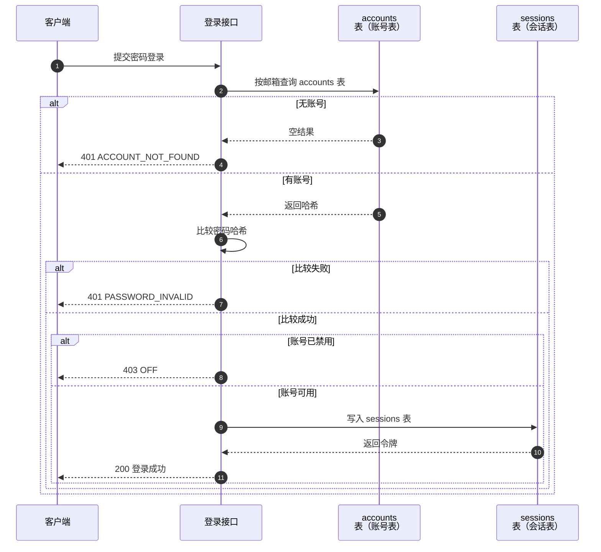
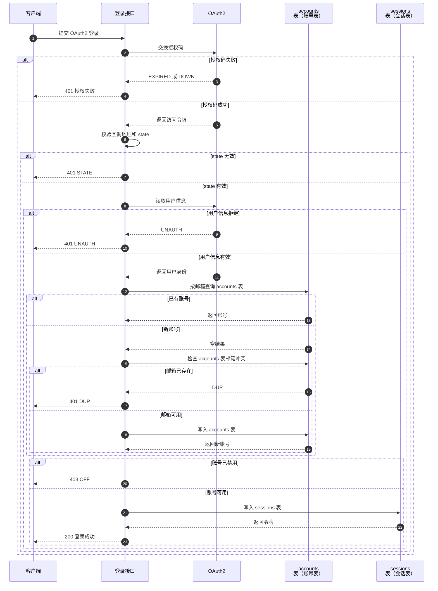

# 用户认证

<!-- biz-flow-entry: url:POST /auth/password-login:app.py:password_login -->

## 密码登录

入口描述：POST /auth/password-login

- 按邮箱查询账号记录。
- 读取密码哈希并进行比较。
- 账号可用时写入会话记录。

### 密码登录分支矩阵

| 分支条件 | 数据读取与比较 | 数据写入与副作用 | 响应 |
| --- | --- | --- | --- |
| 邮箱查询无记录 | 查询 `accounts` 表，结果为空 | 不写入 `accounts` 表和 `sessions` 表 | 401 `ACCOUNT_NOT_FOUND` |
| 密码不匹配 | 读取 `accounts.password_hash`，与请求密码计算结果比较失败 | 不写入 `sessions` 表 | 401 `PASSWORD_INVALID` |
| 账号已禁用 | 读取 `accounts.disabled=true` | 不写入 `sessions` 表 | 403 `OFF` |
| 密码正确且账号可用 | 哈希比较成功，读取 `accounts.disabled=false` | 生成令牌并写入 `sessions` 表 | 200，返回会话令牌 |
| 会话持久化失败 | 哈希比较成功，读取 `accounts.disabled=false` | 写入 `sessions` 表抛出异常，不能确认登录状态 | 403，返回持久化错误 |

<!-- biz-flow-entry: url:POST /auth/oauth2-login:app.py:oauth2_login -->

## OAuth2 登录

入口描述：POST /auth/oauth2-login

- 交换授权码并校验回调地址和 state。
- 读取用户信息后查询本地账号。
- 新账号写入前检查邮箱冲突。
- 账号可用时写入会话记录。

### OAuth2 登录分支矩阵

| 分支条件 | 数据读取与比较 | 数据写入与副作用 | 响应 |
| --- | --- | --- | --- |
| 授权码过期或提供商不可用 | 向 OAuth2 提供商交换授权码失败 | 不写入 `accounts` 表和 `sessions` 表 | 401 `EXPIRED` 或 `DOWN` |
| 回调地址不匹配 | 交换授权码时比较请求回调地址 | 不写入 `accounts` 表和 `sessions` 表 | 401 `REDIRECT_URI` |
| `state` 无效 | 比较请求 `state` 与服务端有效值失败 | 不写入 `accounts` 表和 `sessions` 表 | 401 `STATE` |
| 用户信息读取被拒绝 | 使用访问令牌读取用户信息失败 | 不写入 `accounts` 表和 `sessions` 表 | 401 `UNAUTH` |
| 已有本地账号 | 按 OAuth2 返回邮箱查询 `accounts` 表，账号状态为可用 | 生成令牌并写入 `sessions` 表 | 200，返回会话令牌 |
| 新账号且邮箱可用 | 查询 `accounts` 表为空，写入前再次检查邮箱冲突通过 | 写入 `accounts` 表，再写入 `sessions` 表 | 200，返回会话令牌 |
| 新账号写入冲突 | 写入 `accounts` 表前发现邮箱已存在，或唯一约束冲突 | `accounts` 表写入失败，不写入 `sessions` 表 | 401 `DUP` |
| 已有账号但已禁用 | 查询 `accounts.disabled=true` | 不写入 `sessions` 表 | 403 `OFF` |
| 会话持久化失败 | 账号可用，令牌生成后写入 `sessions` 表异常 | `sessions` 表写入失败，不能确认登录状态 | 403，返回持久化错误 |
