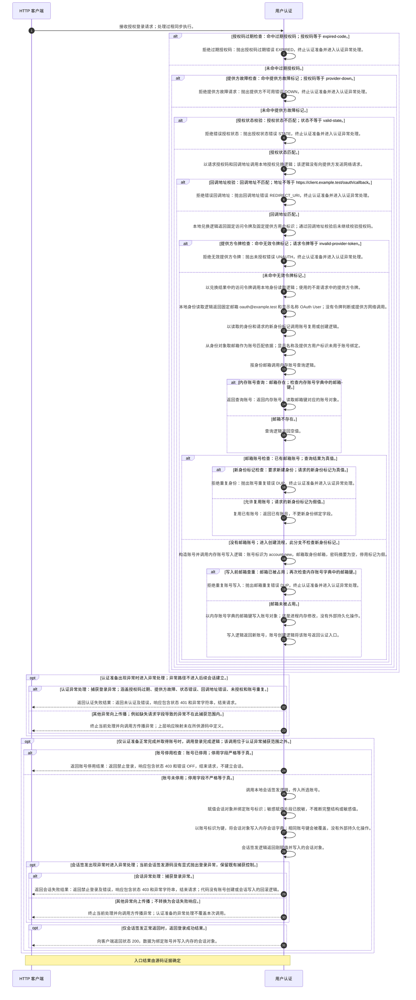
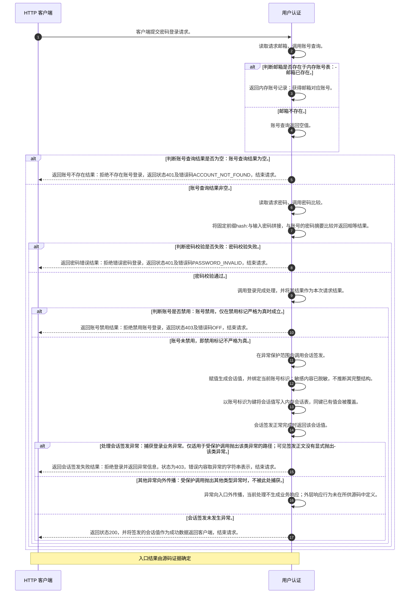

<!-- biz-flow-module: 用户认证 -->
<!-- devflow:flow-source-fingerprint value="e0283ab0135eb7bffb5f7e801f36e4d1099dba09b50a57bfff6bc3909bd6c843" -->
# 用户认证

<!-- devflow:entry-directory -->
## 业务范围与入口

支持密码登录和 OAuth2 登录；完成账号绑定与会话建立。

流程分析状态：已完成。

| 业务入口 | 触发方式 | 入口 ID | 注册证据 |
| --- | --- | --- | --- |
| OAuth2 登录与账号绑定 | HTTP：POST /auth/oauth2-login | `url:POST /auth/oauth2-login:python:app#oauth2_login(dict)` | `app.py:98; app.py:97` |
| 密码登录与会话建立 | HTTP：POST /auth/password-login | `url:POST /auth/password-login:python:app#password_login(dict)` | `app.py:87; app.py:86` |

<!-- /devflow:entry-directory -->

<!-- biz-flow-entry: url:POST /auth/oauth2-login:python:app#oauth2_login(dict) -->

## OAuth2 登录与账号绑定

入口描述：URL POST /auth/oauth2-login

- 校验授权信息，复用或创建账号并建立会话。
- 请求提供授权码、回调地址、状态、提供方令牌及新身份标记。
- 返回成功状态和绑定账号的会话。
- 认证失败返回未认证，停用或会话登录异常返回禁止登录。

### 分支矩阵

| 分支编号 | 分支条件 | 数据读取与比较 | 数据写入与副作用 | 响应 | 持久化编号 |
| --- | --- | --- | --- | --- | --- |
| `B-f5f9cf1e073847d6` | 回调地址校验 | 回调地址校验 | if redirect_uri != 'https://client.example.test/oauth/callback': raise LoginError('REDIRECT_URI') | 回调地址不匹配 / 回调地址匹配 |  |
| `B-1b6c85fb7e7f3957` | 拒绝错误回调地址 | 拒绝错误回调地址 | raise LoginError('REDIRECT_URI') | 抛出回调地址错误 |  |
| `B-1f64cf6c5c6d2797` | 账号停用检查 | 账号停用检查 | if account['disabled'] is True: return {'status': 403, 'error': 'OFF'} | 账号已停用 / 账号未停用 |  |
| `B-0a1934ac73c62e31` | 返回账号停用结果 | 返回账号停用结果 | return {'status': 403, 'error': 'OFF'} | 返回禁止登录 |  |
| `B-63d4db63efc7a4b7` | 会话异常处理 | 会话异常处理 | except LoginError as error: return {'status': 403, 'error': str(error)} | 捕获登录异常 / 其他异常向上传播 |  |
| `B-abab80756c425a22` | 返回会话失败结果 | 返回会话失败结果 | return {'status': 403, 'error': str(error)} | 返回禁止登录及错误 |  |
| `B-dc3e56b7e01e766d` | 邮箱账号检查 | 邮箱账号检查 | if account: if new_identity: raise LoginError('DUP') return account | 已有邮箱账号 / 没有邮箱账号 |  |
| `B-93d9e6f16b37d7e2` | 新身份标记检查 | 新身份标记检查 | if new_identity: raise LoginError('DUP') | 要求新建身份 / 允许复用账号 |  |
| `B-8a357eea859d4fc3` | 拒绝重复身份 | 拒绝重复身份 | raise LoginError('DUP') | 抛出账号重复错误 |  |
| `B-79c00bf6bf6256b2` | 复用已有账号 | 复用已有账号 | return account | 返回已有账号 |  |
| `B-ff7447c1d36317db` | 授权码过期检查 | 授权码过期检查 | if request['code'] == 'expired-code': raise LoginError('EXPIRED') | 命中过期授权码 / 未命中过期授权码 |  |
| `B-3a20aa40dfd645a7` | 拒绝过期授权码 | 拒绝过期授权码 | raise LoginError('EXPIRED') | 抛出授权码过期错误 |  |
| `B-3466dcf077e9b78c` | 提供方故障检查 | 提供方故障检查 | if request['code'] == 'provider-down': raise LoginError('DOWN') | 命中提供方故障标记 / 未命中提供方故障标记 |  |
| `B-3c453faf7641b619` | 拒绝提供方故障请求 | 拒绝提供方故障请求 | raise LoginError('DOWN') | 抛出提供方不可用错误 |  |
| `B-c65ce1587c5a09e7` | 授权状态校验 | 授权状态校验 | if request['state'] != 'valid-state': raise LoginError('STATE') | 授权状态不匹配 / 授权状态匹配 |  |
| `B-13dbaf1406eea7e3` | 拒绝错误授权状态 | 拒绝错误授权状态 | raise LoginError('STATE') | 抛出授权状态错误 |  |
| `B-8a5872c9d62e5e97` | 提供方令牌检查 | 提供方令牌检查 | if request['provider_token'] == 'invalid-provider-token': raise LoginError('UNAUTH') | 命中无效令牌标记 / 未命中无效令牌标记 |  |
| `B-ac24e4bd57aa2734` | 拒绝无效提供方令牌 | 拒绝无效提供方令牌 | raise LoginError('UNAUTH') | 抛出未授权错误 |  |
| `B-bec74fba59979e60` | 认证异常处理 | 认证异常处理 | except LoginError as error: return {'status': 401, 'error': str(error)} | 捕获登录异常 / 其他异常向上传播 |  |
| `B-dcb64d6a75faa544` | 返回认证失败结果 | 返回认证失败结果 | return {'status': 401, 'error': str(error)} | 返回未认证及错误 |  |
| `B-3aa944be358192fb` | 内存账号查询 | 内存账号查询 | if email in ACCOUNTS_TABLE: return ACCOUNTS_TABLE[email] | 邮箱存在 / 邮箱不存在 |  |
| `B-6e4fdef701e7cacf` | 返回查询账号 | 返回查询账号 | return ACCOUNTS_TABLE[email] | 返回内存账号 |  |
| `B-eced60723cb0b753` | 写入前邮箱查重 | 写入前邮箱查重 | if account['email'] in ACCOUNTS_TABLE: raise LoginError('DUP') | 邮箱已被占用 / 邮箱未被占用 |  |
| `B-eeb1ece8b1e1072f` | 拒绝重复账号写入 | 拒绝重复账号写入 | raise LoginError('DUP') | 抛出邮箱重复错误 |  |
|  | DUP | account["email"] in ACCOUNTS_TABLE -> raise LoginError("DUP") | 不写入持久化数据 | DUP |  |
|  | REDIRECT_URI | redirect_uri != "https://client.example.test/oauth/callback" -> raise LoginError("REDIRECT_URI") | 不写入持久化数据 | REDIRECT_URI |  |
|  | DUP | account 且 new_identity -> raise LoginError("DUP") | 不写入持久化数据 | DUP |  |

<!-- biz-flow-entry: url:POST /auth/password-login:python:app#password_login(dict) -->

## 密码登录与会话建立

入口描述：URL POST /auth/password-login

- 验证账号和密码，为未禁用账号建立会话。
- 客户端提供邮箱和密码。
- 登录成功返回会话，并按账号标识写入内存会话表。
- 账号不存在或密码错误返回401，禁用或捕获登录异常返回403。

### 分支矩阵

| 分支编号 | 分支条件 | 数据读取与比较 | 数据写入与副作用 | 响应 | 持久化编号 |
| --- | --- | --- | --- | --- | --- |
| `B-f810d9bfcf21eb88` | 判断账号是否禁用 | 判断账号是否禁用 | if account['disabled'] is True: return {'status': 403, 'error': 'OFF'} | 账号禁用 / 账号未禁用 |  |
| `B-e44cf8888d3baa59` | 返回账号禁用结果 | 返回账号禁用结果 | return {'status': 403, 'error': 'OFF'} | 拒绝禁用账号登录 |  |
| `B-39732af25ee083e1` | 处理会话签发异常 | 处理会话签发异常 | except LoginError as error: return {'status': 403, 'error': str(error)} | 捕获登录业务异常 / 其他异常向外传播 |  |
| `B-8ac065de68d3f1ff` | 返回会话签发失败结果 | 返回会话签发失败结果 | return {'status': 403, 'error': str(error)} | 拒绝登录并返回异常信息 |  |
| `B-295aee90d1069965` | 判断账号查询结果是否为空 | 判断账号查询结果是否为空 | if not account: return {'status': 401, 'error': 'ACCOUNT_NOT_FOUND'} | 账号查询结果为空 / 账号查询结果非空 |  |
| `B-921774f584dc5360` | 返回账号不存在结果 | 返回账号不存在结果 | return {'status': 401, 'error': 'ACCOUNT_NOT_FOUND'} | 拒绝不存在账号登录 |  |
| `B-ebacbed7181988a2` | 判断密码校验是否失败 | 判断密码校验是否失败 | if not compare_password_hash(account, request['password']): return {'status': 401, 'error': 'PASSWOR | 密码校验失败 / 密码校验通过 |  |
| `B-a0c022e2efe50d02` | 返回密码错误结果 | 返回密码错误结果 | return {'status': 401, 'error': 'PASSWORD_INVALID'} | 拒绝错误密码登录 |  |
| `B-9a9c5d7b7fdeea15` | 判断邮箱是否存在于内存账号表 | 判断邮箱是否存在于内存账号表 | if email in ACCOUNTS_TABLE: return ACCOUNTS_TABLE[email] | 邮箱已存在 / 邮箱不存在 |  |
| `B-0203ebcb1a65cc8a` | 返回内存账号记录 | 返回内存账号记录 | return ACCOUNTS_TABLE[email] | 获得邮箱对应账号 |  |
