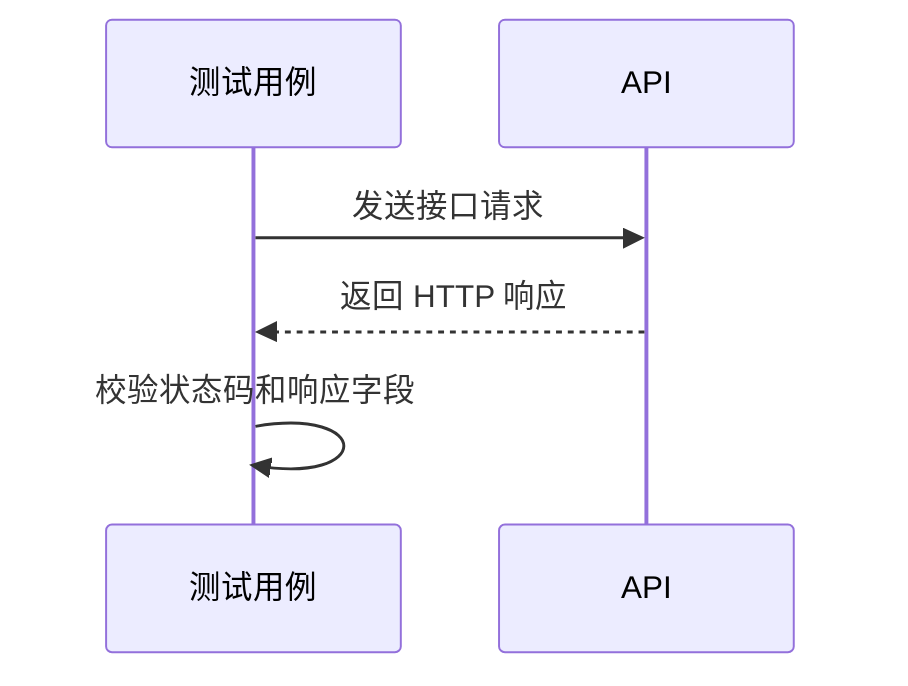

# API 自动化测试契约

本目录按 Swagger Tag 隔离接口契约、业务逻辑、自动化用例和执行流程。

## 模块总览

## 接口调用流程

<!-- MODULE_START: tasks -->
### [tasks](模块/任务管理/CASES.md)

- 业务范围：租户-范围d task creation, search, retrieval, 和 cancellation
- 包含内容：接口 4 个，以及本模块独立的参数、定义、响应、逻辑、用例、流程和排除项。
- Swagger Tag：`tasks`

| 方法 | 路径 | 业务说明 |
| --- | --- | --- |
| GET | `/tasks` | 查询任务列表 |
| POST | `/tasks` | 创建任务 |
| GET | `/tasks/{taskId}` | Get a task |
| POST | `/tasks/{taskId}/cancel` | Request cancellation |
<!-- MODULE_END: tasks -->
