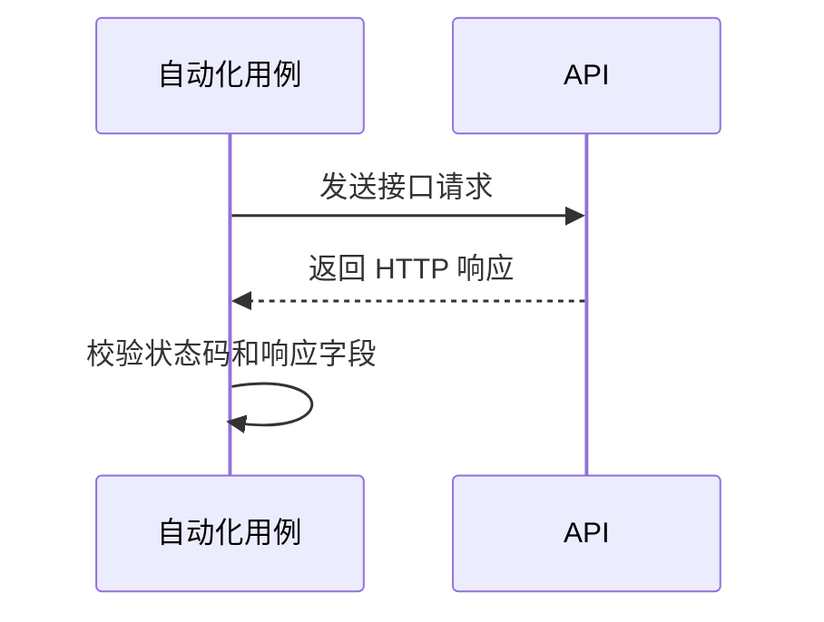

<!-- AUTO_MODULE_START -->
# tasks模块

- 模块 ID：`tasks`
- Swagger Tag：`tasks`
- 业务范围：按租户隔离的任务创建、搜索、查询和取消

## 模块内容

- `接口.yaml`：模块接口清单和场景决策。
- `参数.yaml`：模块独立的请求参数。
- `definitions.yaml`：模块独立的数据定义。
- `响应s.yaml`：模块独立的响应定义。
- `logic.yaml`：设计文档确认的业务路径和预期。
- `用例.yaml`：自动化用例、预期结果和断言。
- `流程.yaml`：有序业务操作流程。
- `exclusions.yaml`：经审批的排除项及原因。

## 接口清单

| 方法 | 路径 | 业务说明 |
| --- | --- | --- |
| GET | `/tasks` | 查询任务列表 |
| POST | `/tasks` | 创建任务 |
| GET | `/tasks/{taskId}` | Get a task |
| POST | `/tasks/{taskId}/cancel` | Request cancellation |
<!-- AUTO_MODULE_END -->

## 自动化用例

| 用例 ID | 场景 | 接口 | 预期状态 |
| --- | --- | --- | --- |
| `CREATETASK_POST_TASKS_TASK_CREATE_ACCEPTED` | 设计规则 CREATETASK_POST_TASKS - 设计规则 TASK_CREATE_ACCEPTED | `POST /tasks` | 201 |
| `CREATETASK_POST_TASKS_TASK_CREATE_CONFLICT` | 设计规则 CREATETASK_POST_TASKS - 设计规则 TASK_CREATE_CONFLICT | `POST /tasks` | 409 |
| `LISTTASKS_GET_TASKS_TASK_LIST_PAGE` | 设计规则 LISTTASKS_GET_TASKS - 设计规则 TASK_LIST_PAGE | `GET /tasks` | 200 |
| `LISTTASKS_GET_TASKS_TASK_LIST_EMPTY` | 设计规则 LISTTASKS_GET_TASKS - 设计规则 TASK_LIST_EMPTY | `GET /tasks` | 200 |
| `GETTASK_GET_TASKS_TASKID_TASK_GET_OWNED` | 设计规则 GETTASK_GET_TASKS_TASKID - 设计规则 TASK_GET_OWNED | `GET /tasks/{taskId}` | 200 |
| `GETTASK_GET_TASKS_TASKID_TASK_GET_MISSING` | 设计规则 GETTASK_GET_TASKS_TASKID - 设计规则 TASK_GET_MISSING | `GET /tasks/{taskId}` | 404 |
| `CANCELTASK_POST_TASKS_TASKID_CANCEL_TASK_CANCEL_QUEUED` | 设计规则 CANCELTASK_POST_TASKS_TASKID_CANCEL - 设计规则 TASK_CANCEL_QUEUED | `POST /tasks/{taskId}/cancel` | 202 |
| `CANCELTASK_POST_TASKS_TASKID_CANCEL_TASK_CANCEL_RUNNING` | 设计规则 CANCELTASK_POST_TASKS_TASKID_CANCEL - 设计规则 TASK_CANCEL_RUNNING | `POST /tasks/{taskId}/cancel` | 409 |
| `LISTTASKS_GET_TASKS_SUCCESS` | 查询任务列表成功 | `GET /tasks` | 200 |
| `LISTTASKS_GET_TASKS_MISSING_X_TENANT_ID` | 查询任务列表失败：缺少必填 Header X-Tenant-Id | `GET /tasks` | 400 |
| `LISTTASKS_GET_TASKS_INVALID_MINLENGTH_X_TENANT_ID` | 查询任务列表失败：参数 X-Tenant-Id 短于最小长度 | `GET /tasks` | 400 |
| `LISTTASKS_GET_TASKS_INVALID_MINIMUM_PAGE` | 查询任务列表失败：参数 page 小于最小值 | `GET /tasks` | 400 |
| `LISTTASKS_GET_TASKS_BOUNDARY_PAGE` | 查询任务列表：分页参数 page 取边界值 0 | `GET /tasks` | 400 |
| `LISTTASKS_GET_TASKS_INVALID_MINIMUM_PAGESIZE` | 查询任务列表失败：参数 pageSize 小于最小值 | `GET /tasks` | 400 |
| `LISTTASKS_GET_TASKS_INVALID_MAXIMUM_PAGESIZE` | 查询任务列表失败：参数 pageSize 大于最大值 | `GET /tasks` | 400 |
| `LISTTASKS_GET_TASKS_BOUNDARY_PAGESIZE` | 查询任务列表：分页参数 pageSize 取边界值 0 | `GET /tasks` | 400 |
| `LISTTASKS_GET_TASKS_INVALID_STATUS` | 查询任务列表失败：参数 状态 使用非法枚举值 | `GET /tasks` | 400 |
| `LISTTASKS_GET_TASKS_INVALID_SORT` | 查询任务列表失败：参数 s或t 使用非法枚举值 | `GET /tasks` | 400 |
| `LISTTASKS_GET_TASKS_QUERY_STATUS` | 查询任务列表：查询参数 状态 | `GET /tasks` | 200 |
| `LISTTASKS_GET_TASKS_QUERY_SORT` | 查询任务列表：查询参数 s或t | `GET /tasks` | 200 |
| `LISTTASKS_GET_TASKS_QUERY_COMBINED` | 查询任务列表：组合查询 | `GET /tasks` | 200 |
| `CREATETASK_POST_TASKS_SUCCESS` | 创建任务成功 | `POST /tasks` | 201 |
| `CREATETASK_POST_TASKS_MISSING_X_TENANT_ID` | 创建任务失败：缺少必填 Header X-Tenant-Id | `POST /tasks` | 400 |
| `CREATETASK_POST_TASKS_INVALID_MINLENGTH_X_TENANT_ID` | 创建任务失败：参数 X-Tenant-Id 短于最小长度 | `POST /tasks` | 400 |
| `CREATETASK_POST_TASKS_MISSING_IDEMPOTENCY_KEY` | 创建任务失败：缺少必填 Header Idempotency-Key | `POST /tasks` | 400 |
| `CREATETASK_POST_TASKS_INVALID_MINLENGTH_IDEMPOTENCY_KEY` | 创建任务失败：参数 Idempotency-Key 短于最小长度 | `POST /tasks` | 400 |
| `CREATETASK_POST_TASKS_INVALID_MAXLENGTH_IDEMPOTENCY_KEY` | 创建任务失败：参数 Idempotency-Key 超过最大长度 | `POST /tasks` | 400 |
| `CREATETASK_POST_TASKS_MISSING_BODY_TASKTYPE` | 创建任务失败：缺少必填字段 请求体.taskType | `POST /tasks` | 400 |
| `CREATETASK_POST_TASKS_MISSING_BODY_PAYLOAD` | 创建任务失败：缺少必填字段 请求体.payload | `POST /tasks` | 400 |
| `CREATETASK_POST_TASKS_INVALID_BODY_ENUM_TASKTYPE` | 创建任务失败：字段 请求体.taskType 使用非法枚举值 | `POST /tasks` | 400 |
| `CREATETASK_POST_TASKS_INVALID_CONTENT_TYPE` | 创建任务失败：Content-Type 错误 | `POST /tasks` | 415 |
| `GETTASK_GET_TASKS_TASKID_SUCCESS` | Get a task成功 | `GET /tasks/{taskId}` | 200 |
| `CANCELTASK_POST_TASKS_TASKID_CANCEL_SUCCESS` | Request cancellation成功受理 | `POST /tasks/{taskId}/cancel` | 202 |

<!-- AUTO_CASES_START -->

<!-- CASE_START: CREATETASK_POST_TASKS_TASK_CREATE_ACCEPTED -->
### 设计规则 CREATETASK_POST_TASKS - 设计规则 TASK_CREATE_ACCEPTED

- 用例 ID：`CREATETASK_POST_TASKS_TASK_CREATE_ACCEPTED`
- 接口：`POST /tasks`

简短描述：验证设计规则 CREATETASK_POST_TASKS
<!-- CASE_END: CREATETASK_POST_TASKS_TASK_CREATE_ACCEPTED -->

<!-- CASE_START: CREATETASK_POST_TASKS_TASK_CREATE_CONFLICT -->
### 设计规则 CREATETASK_POST_TASKS - 设计规则 TASK_CREATE_CONFLICT

- 用例 ID：`CREATETASK_POST_TASKS_TASK_CREATE_CONFLICT`
- 接口：`POST /tasks`

简短描述：验证设计规则 CREATETASK_POST_TASKS
<!-- CASE_END: CREATETASK_POST_TASKS_TASK_CREATE_CONFLICT -->

<!-- CASE_START: LISTTASKS_GET_TASKS_TASK_LIST_PAGE -->
### 设计规则 LISTTASKS_GET_TASKS - 设计规则 TASK_LIST_PAGE

- 用例 ID：`LISTTASKS_GET_TASKS_TASK_LIST_PAGE`
- 接口：`GET /tasks`

简短描述：验证设计规则 LISTTASKS_GET_TASKS
<!-- CASE_END: LISTTASKS_GET_TASKS_TASK_LIST_PAGE -->

<!-- CASE_START: LISTTASKS_GET_TASKS_TASK_LIST_EMPTY -->
### 设计规则 LISTTASKS_GET_TASKS - 设计规则 TASK_LIST_EMPTY

- 用例 ID：`LISTTASKS_GET_TASKS_TASK_LIST_EMPTY`
- 接口：`GET /tasks`

简短描述：验证设计规则 LISTTASKS_GET_TASKS
<!-- CASE_END: LISTTASKS_GET_TASKS_TASK_LIST_EMPTY -->

<!-- CASE_START: GETTASK_GET_TASKS_TASKID_TASK_GET_OWNED -->
### 设计规则 GETTASK_GET_TASKS_TASKID - 设计规则 TASK_GET_OWNED

- 用例 ID：`GETTASK_GET_TASKS_TASKID_TASK_GET_OWNED`
- 接口：`GET /tasks/{taskId}`

简短描述：验证设计规则 GETTASK_GET_TASKS_TASKID
<!-- CASE_END: GETTASK_GET_TASKS_TASKID_TASK_GET_OWNED -->

<!-- CASE_START: GETTASK_GET_TASKS_TASKID_TASK_GET_MISSING -->
### 设计规则 GETTASK_GET_TASKS_TASKID - 设计规则 TASK_GET_MISSING

- 用例 ID：`GETTASK_GET_TASKS_TASKID_TASK_GET_MISSING`
- 接口：`GET /tasks/{taskId}`

简短描述：验证设计规则 GETTASK_GET_TASKS_TASKID
<!-- CASE_END: GETTASK_GET_TASKS_TASKID_TASK_GET_MISSING -->

<!-- CASE_START: CANCELTASK_POST_TASKS_TASKID_CANCEL_TASK_CANCEL_QUEUED -->
### 设计规则 CANCELTASK_POST_TASKS_TASKID_CANCEL - 设计规则 TASK_CANCEL_QUEUED

- 用例 ID：`CANCELTASK_POST_TASKS_TASKID_CANCEL_TASK_CANCEL_QUEUED`
- 接口：`POST /tasks/{taskId}/cancel`

简短描述：验证设计规则 CANCELTASK_POST_TASKS_TASKID_CANCEL
<!-- CASE_END: CANCELTASK_POST_TASKS_TASKID_CANCEL_TASK_CANCEL_QUEUED -->

<!-- CASE_START: CANCELTASK_POST_TASKS_TASKID_CANCEL_TASK_CANCEL_RUNNING -->
### 设计规则 CANCELTASK_POST_TASKS_TASKID_CANCEL - 设计规则 TASK_CANCEL_RUNNING

- 用例 ID：`CANCELTASK_POST_TASKS_TASKID_CANCEL_TASK_CANCEL_RUNNING`
- 接口：`POST /tasks/{taskId}/cancel`

简短描述：验证设计规则 CANCELTASK_POST_TASKS_TASKID_CANCEL
<!-- CASE_END: CANCELTASK_POST_TASKS_TASKID_CANCEL_TASK_CANCEL_RUNNING -->

<!-- CASE_START: LISTTASKS_GET_TASKS_SUCCESS -->
### 查询任务列表成功

- 用例 ID：`LISTTASKS_GET_TASKS_SUCCESS`
- 接口：`GET /tasks`

简短描述：验证查询任务列表的正常场景。
<!-- CASE_END: LISTTASKS_GET_TASKS_SUCCESS -->

<!-- CASE_START: LISTTASKS_GET_TASKS_MISSING_X_TENANT_ID -->
### 查询任务列表失败：缺少必填 Header X-Tenant-Id

- 用例 ID：`LISTTASKS_GET_TASKS_MISSING_X_TENANT_ID`
- 接口：`GET /tasks`

简短描述：验证查询任务列表的缺少必填 Header X-Tenant-Id场景。
<!-- CASE_END: LISTTASKS_GET_TASKS_MISSING_X_TENANT_ID -->

<!-- CASE_START: LISTTASKS_GET_TASKS_INVALID_MINLENGTH_X_TENANT_ID -->
### 查询任务列表失败：参数 X-Tenant-Id 短于最小长度

- 用例 ID：`LISTTASKS_GET_TASKS_INVALID_MINLENGTH_X_TENANT_ID`
- 接口：`GET /tasks`

简短描述：验证查询任务列表的参数 X-Tenant-Id 短于最小长度场景。
<!-- CASE_END: LISTTASKS_GET_TASKS_INVALID_MINLENGTH_X_TENANT_ID -->

<!-- CASE_START: LISTTASKS_GET_TASKS_INVALID_MINIMUM_PAGE -->
### 查询任务列表失败：参数 page 小于最小值

- 用例 ID：`LISTTASKS_GET_TASKS_INVALID_MINIMUM_PAGE`
- 接口：`GET /tasks`

简短描述：验证查询任务列表的参数 page 小于最小值场景。
<!-- CASE_END: LISTTASKS_GET_TASKS_INVALID_MINIMUM_PAGE -->

<!-- CASE_START: LISTTASKS_GET_TASKS_BOUNDARY_PAGE -->
### 查询任务列表：分页参数 page 取边界值 0

- 用例 ID：`LISTTASKS_GET_TASKS_BOUNDARY_PAGE`
- 接口：`GET /tasks`

简短描述：验证查询任务列表的分页参数 page 取边界值 0场景。
<!-- CASE_END: LISTTASKS_GET_TASKS_BOUNDARY_PAGE -->

<!-- CASE_START: LISTTASKS_GET_TASKS_INVALID_MINIMUM_PAGESIZE -->
### 查询任务列表失败：参数 pageSize 小于最小值

- 用例 ID：`LISTTASKS_GET_TASKS_INVALID_MINIMUM_PAGESIZE`
- 接口：`GET /tasks`

简短描述：验证查询任务列表的参数 pageSize 小于最小值场景。
<!-- CASE_END: LISTTASKS_GET_TASKS_INVALID_MINIMUM_PAGESIZE -->

<!-- CASE_START: LISTTASKS_GET_TASKS_INVALID_MAXIMUM_PAGESIZE -->
### 查询任务列表失败：参数 pageSize 大于最大值

- 用例 ID：`LISTTASKS_GET_TASKS_INVALID_MAXIMUM_PAGESIZE`
- 接口：`GET /tasks`

简短描述：验证查询任务列表的参数 pageSize 大于最大值场景。
<!-- CASE_END: LISTTASKS_GET_TASKS_INVALID_MAXIMUM_PAGESIZE -->

<!-- CASE_START: LISTTASKS_GET_TASKS_BOUNDARY_PAGESIZE -->
### 查询任务列表：分页参数 pageSize 取边界值 0

- 用例 ID：`LISTTASKS_GET_TASKS_BOUNDARY_PAGESIZE`
- 接口：`GET /tasks`

简短描述：验证查询任务列表的分页参数 pageSize 取边界值 0场景。
<!-- CASE_END: LISTTASKS_GET_TASKS_BOUNDARY_PAGESIZE -->

<!-- CASE_START: LISTTASKS_GET_TASKS_INVALID_STATUS -->
### 查询任务列表失败：参数 状态 使用非法枚举值

- 用例 ID：`LISTTASKS_GET_TASKS_INVALID_STATUS`
- 接口：`GET /tasks`

简短描述：验证查询任务列表的参数 状态 使用非法枚举值场景。
<!-- CASE_END: LISTTASKS_GET_TASKS_INVALID_STATUS -->

<!-- CASE_START: LISTTASKS_GET_TASKS_INVALID_SORT -->
### 查询任务列表失败：参数 s或t 使用非法枚举值

- 用例 ID：`LISTTASKS_GET_TASKS_INVALID_SORT`
- 接口：`GET /tasks`

简短描述：验证查询任务列表的参数 s或t 使用非法枚举值场景。
<!-- CASE_END: LISTTASKS_GET_TASKS_INVALID_SORT -->

<!-- CASE_START: LISTTASKS_GET_TASKS_QUERY_STATUS -->
### 查询任务列表：查询参数 状态

- 用例 ID：`LISTTASKS_GET_TASKS_QUERY_STATUS`
- 接口：`GET /tasks`

简短描述：验证查询任务列表的查询参数 状态场景。
<!-- CASE_END: LISTTASKS_GET_TASKS_QUERY_STATUS -->

<!-- CASE_START: LISTTASKS_GET_TASKS_QUERY_SORT -->
### 查询任务列表：查询参数 s或t

- 用例 ID：`LISTTASKS_GET_TASKS_QUERY_SORT`
- 接口：`GET /tasks`

简短描述：验证查询任务列表的查询参数 s或t场景。
<!-- CASE_END: LISTTASKS_GET_TASKS_QUERY_SORT -->

<!-- CASE_START: LISTTASKS_GET_TASKS_QUERY_COMBINED -->
### 查询任务列表：组合查询

- 用例 ID：`LISTTASKS_GET_TASKS_QUERY_COMBINED`
- 接口：`GET /tasks`

简短描述：验证查询任务列表的组合查询场景。
<!-- CASE_END: LISTTASKS_GET_TASKS_QUERY_COMBINED -->

<!-- CASE_START: CREATETASK_POST_TASKS_SUCCESS -->
### 创建任务成功

- 用例 ID：`CREATETASK_POST_TASKS_SUCCESS`
- 接口：`POST /tasks`

简短描述：验证创建任务的正常场景。
<!-- CASE_END: CREATETASK_POST_TASKS_SUCCESS -->

<!-- CASE_START: CREATETASK_POST_TASKS_MISSING_X_TENANT_ID -->
### 创建任务失败：缺少必填 Header X-Tenant-Id

- 用例 ID：`CREATETASK_POST_TASKS_MISSING_X_TENANT_ID`
- 接口：`POST /tasks`

简短描述：验证创建任务的缺少必填 Header X-Tenant-Id场景。
<!-- CASE_END: CREATETASK_POST_TASKS_MISSING_X_TENANT_ID -->

<!-- CASE_START: CREATETASK_POST_TASKS_INVALID_MINLENGTH_X_TENANT_ID -->
### 创建任务失败：参数 X-Tenant-Id 短于最小长度

- 用例 ID：`CREATETASK_POST_TASKS_INVALID_MINLENGTH_X_TENANT_ID`
- 接口：`POST /tasks`

简短描述：验证创建任务的参数 X-Tenant-Id 短于最小长度场景。
<!-- CASE_END: CREATETASK_POST_TASKS_INVALID_MINLENGTH_X_TENANT_ID -->

<!-- CASE_START: CREATETASK_POST_TASKS_MISSING_IDEMPOTENCY_KEY -->
### 创建任务失败：缺少必填 Header Idempotency-Key

- 用例 ID：`CREATETASK_POST_TASKS_MISSING_IDEMPOTENCY_KEY`
- 接口：`POST /tasks`

简短描述：验证创建任务的缺少必填 Header Idempotency-Key场景。
<!-- CASE_END: CREATETASK_POST_TASKS_MISSING_IDEMPOTENCY_KEY -->

<!-- CASE_START: CREATETASK_POST_TASKS_INVALID_MINLENGTH_IDEMPOTENCY_KEY -->
### 创建任务失败：参数 Idempotency-Key 短于最小长度

- 用例 ID：`CREATETASK_POST_TASKS_INVALID_MINLENGTH_IDEMPOTENCY_KEY`
- 接口：`POST /tasks`

简短描述：验证创建任务的参数 Idempotency-Key 短于最小长度场景。
<!-- CASE_END: CREATETASK_POST_TASKS_INVALID_MINLENGTH_IDEMPOTENCY_KEY -->

<!-- CASE_START: CREATETASK_POST_TASKS_INVALID_MAXLENGTH_IDEMPOTENCY_KEY -->
### 创建任务失败：参数 Idempotency-Key 超过最大长度

- 用例 ID：`CREATETASK_POST_TASKS_INVALID_MAXLENGTH_IDEMPOTENCY_KEY`
- 接口：`POST /tasks`

简短描述：验证创建任务的参数 Idempotency-Key 超过最大长度场景。
<!-- CASE_END: CREATETASK_POST_TASKS_INVALID_MAXLENGTH_IDEMPOTENCY_KEY -->

<!-- CASE_START: CREATETASK_POST_TASKS_MISSING_BODY_TASKTYPE -->
### 创建任务失败：缺少必填字段 请求体.taskType

- 用例 ID：`CREATETASK_POST_TASKS_MISSING_BODY_TASKTYPE`
- 接口：`POST /tasks`

简短描述：验证创建任务的缺少必填字段 请求体.taskType场景。
<!-- CASE_END: CREATETASK_POST_TASKS_MISSING_BODY_TASKTYPE -->

<!-- CASE_START: CREATETASK_POST_TASKS_MISSING_BODY_PAYLOAD -->
### 创建任务失败：缺少必填字段 请求体.payload

- 用例 ID：`CREATETASK_POST_TASKS_MISSING_BODY_PAYLOAD`
- 接口：`POST /tasks`

简短描述：验证创建任务的缺少必填字段 请求体.payload场景。
<!-- CASE_END: CREATETASK_POST_TASKS_MISSING_BODY_PAYLOAD -->

<!-- CASE_START: CREATETASK_POST_TASKS_INVALID_BODY_ENUM_TASKTYPE -->
### 创建任务失败：字段 请求体.taskType 使用非法枚举值

- 用例 ID：`CREATETASK_POST_TASKS_INVALID_BODY_ENUM_TASKTYPE`
- 接口：`POST /tasks`

简短描述：验证创建任务的字段 请求体.taskType 使用非法枚举值场景。
<!-- CASE_END: CREATETASK_POST_TASKS_INVALID_BODY_ENUM_TASKTYPE -->

<!-- CASE_START: CREATETASK_POST_TASKS_INVALID_CONTENT_TYPE -->
### 创建任务失败：Content-Type 错误

- 用例 ID：`CREATETASK_POST_TASKS_INVALID_CONTENT_TYPE`
- 接口：`POST /tasks`

简短描述：验证创建任务的Content-Type 错误场景。
<!-- CASE_END: CREATETASK_POST_TASKS_INVALID_CONTENT_TYPE -->

<!-- CASE_START: GETTASK_GET_TASKS_TASKID_SUCCESS -->
### Get a task成功

- 用例 ID：`GETTASK_GET_TASKS_TASKID_SUCCESS`
- 接口：`GET /tasks/{taskId}`

简短描述：验证Get a task的正常场景。
<!-- CASE_END: GETTASK_GET_TASKS_TASKID_SUCCESS -->

<!-- CASE_START: CANCELTASK_POST_TASKS_TASKID_CANCEL_SUCCESS -->
### Request cancellation成功受理

- 用例 ID：`CANCELTASK_POST_TASKS_TASKID_CANCEL_SUCCESS`
- 接口：`POST /tasks/{taskId}/cancel`

简短描述：验证Request cancellation的正常场景。
<!-- CASE_END: CANCELTASK_POST_TASKS_TASKID_CANCEL_SUCCESS -->
<!-- AUTO_CASES_END -->
